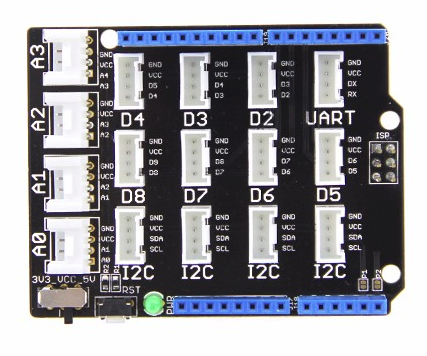

Development board Maixduino
===========

* Arduino UNO R3 Pins compatible
* Maix M1 module
* ESP32-WROOM-32 WiFi module (2.4G WiFi + Bluetooth)
* 4 indicators (esp32 and k210 serial port send and receive indicators)
* 2 buttons (reset and start selection (customizable function after power on) button)
* Type-C interface
* Micro SD card slot
* 1 CH552 USB to TTL chip
* 2 FPC carriers (camera and screen)
* 1 Mic
* 1 mono audio amplifier (NS4150)
* 1 LCD touch screen (optional)
* 1 1.25mm audio output female

## Attention

Although the shape and `Pin` are compatible with `Arduino UNO R3`, the voltage level is not compatible, which requires great attention, otherwise the board may be damaged!

`Maixduino` supports `3.3V` and `1.8V` levels, and the pins are divided into several `BANK`, each `BANK` can be set to a voltage of `1.8V` or `3.3V` by software,
However, these **pins are not `5V' tolerated**.

Therefore, when using the peripheral device of `Arduino`, be careful not to short the `5V` to the pin or `RST` (`1.8V`) pin, otherwise the board may be damaged!

> For example, this [Base Shield V2 expansion board](http://wiki.seeedstudio.com/Base_Shield_V2/):
>
> 
> 
> 
> As can be seen from the design above, since the shield board is designed to be compatible with `5V` and `3.3V` designs, **must not** turn the switch to `5V`, otherwise the board will be damaged!
> 
> For this shield board, if you must prevent this problem from occurring, in view of the above circuit diagram, you can reduce the `RST` pin of the adapter board or solder off the resistor `R2`. Of course, this only prevents board damaged when the shield connected to nothing!

## Assembly

Pay attention to the installation direction of the camera and screen, otherwise it may not work or damage the device.

The camera is facing the back:

Screen facing the front

## Docs & Downloads

* [Pin map PNG picture Download](https://cdn.sipeed.com/wiki/maix/maixduino/maixduino_pins.png)
* Specifications(include Pin map form):[Specifications](http://dl.sipeed.com/MAIX/HDK/Maixduino/Specifications/)
* Hardware Information: [dl.sipeed.com](http://dl.sipeed.com/MAIX/HDK/Maixduino/)
* [SDK](../sdk/README.md): Applies to all SDKs of the k210 series

