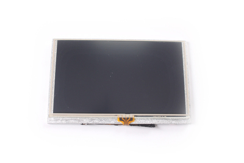
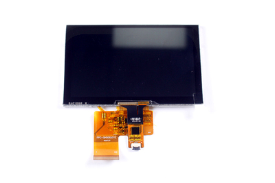

LCD module
========

## 320x240 LCD Module

Works with the Maix Series K210 Development Board

### Docs & Downloads

* [Maix LCD Hardware Data](http://dl.sipeed.com/MAIX/HDK/Maix-LCD/)
* [LCD Hardware Information](http://dl.sipeed.com/Accessories/LCD/)

## LicheePi display module

For details, see [Taobao](https://item.taobao.com/item.htm?id=585048350908#), and [here](https://item.taobao.com/item.htm?spm=a1z10.5-c-s.w4002-21231188711.12.549d4220iNIEmi&id=584657396198)

* [LCD Hardware Information](http://dl.sipeed.com/Accessories/LCD/)

