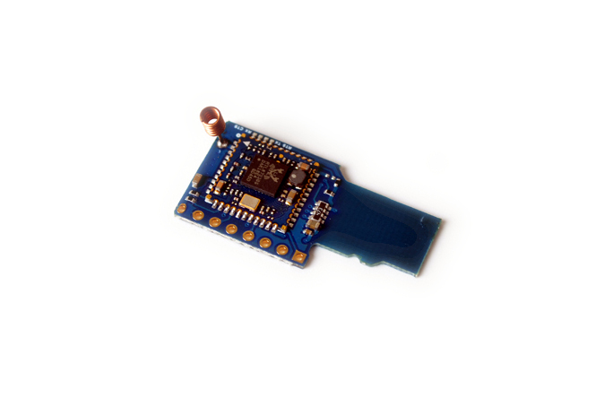

WiFi module
======

## ESP8089 WiFi Module (for LicheePi Nano)

SDIO interface, currently only available on Lychee Nano

## WiFi_BT Module (for LicheePi Zero)

The main control of the WiFi+BT module is RTL8723BS, which is more stable and reliable. In the form of a TF interface, it can be directly inserted into the TF card slot on the board.

