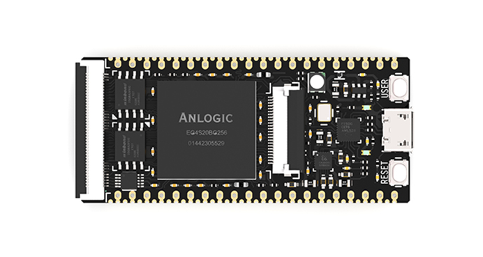

Lichee Tang(Chinese means sugar) Premier
==========

Lichee Tang uses Anlogic Technologies' EG4S20 as the core unit, 20K logic unit (LUT4/LUT5 hybrid architecture), approximately 130KB SRAM, built-in 32bit bit width 64MBit SDRAM, rich LVDS pin, built-in 12-bit 1MSPS ADC This provides unlimited possibilities for Lichee Tang sugar, the basic characteristics of the development board:

* FPC40P seat, can be connected to RGB LCD, VGA adapter board, high speed DAC module
* FPC24P seat, can be connected to DVP camera, high speed ADC module
* Resistive touch screen controller for I2C interface, used with RGB LCD

* 3-channel DCDC power chip, stable and efficient power supply, independent adjustment of Bank0 IO level
* FPGA configuration Flash, 8Mbit
* User Flash, nor/nand optional
* Onboard FPGA JTAG download debugger
* RGB LED

* The adjacent pin LVDS is drawn in the same length, which leads to 8 GCLKs and leads to 8 ADCs.
* Double row pin spacing 900mil, compatible with breadboard development.
* Half hole leads to an additional 40 IO and the entire board leads to 130+ IO.

## Docs & Downloads

* [Chinese documentation](http://tang.lichee.pro)
* [English documentation](https://tang.sipeed.com/en/)
* [Hardware Information](http://dl.sipeed.com/TANG/Primer/HDK/)
* [More related information download](http://dl.sipeed.com/TANG/Primer/)

