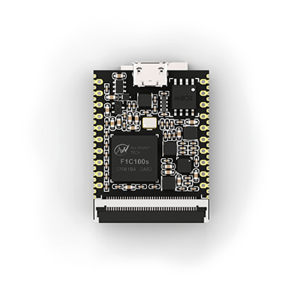
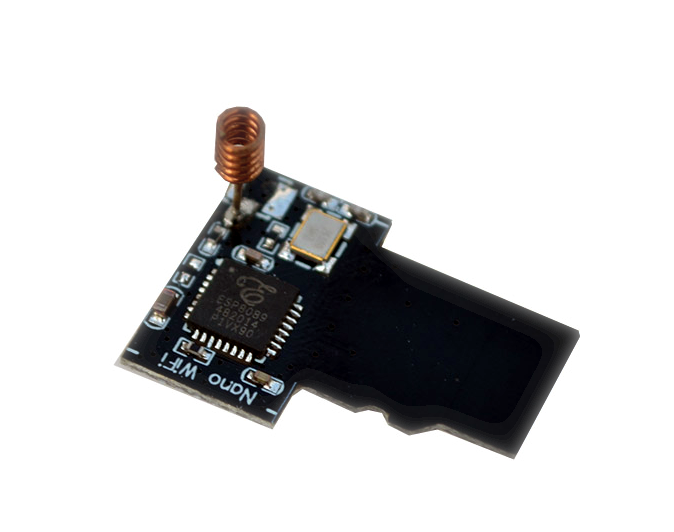
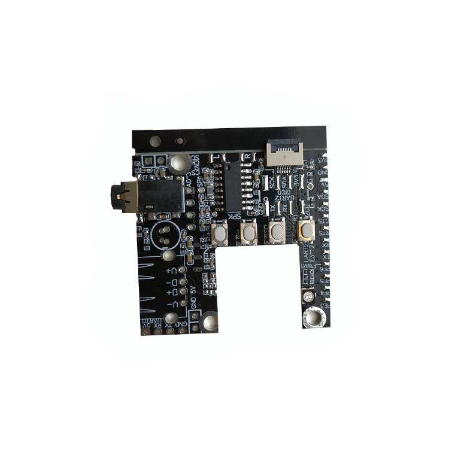

荔枝派 Nano
============

荔枝派 Nano，开启你的极客之心。这是一款仅有2.54cm X 3.3cm大小的精致小板，相当于一张SD卡大小，只要您愿意，即可将一颗极客芯随身携带。

更多详细介绍请看 [文档](http://nano.lichee.pro/)

可选搭配 :

* [WiFi 8089 模块](../modules/wifi.md)

* 扩展板

## 资料

* [文档](http://nano.lichee.pro/)
* [其它资料](http://dl.sipeed.com/LICHEE/Nano/)

