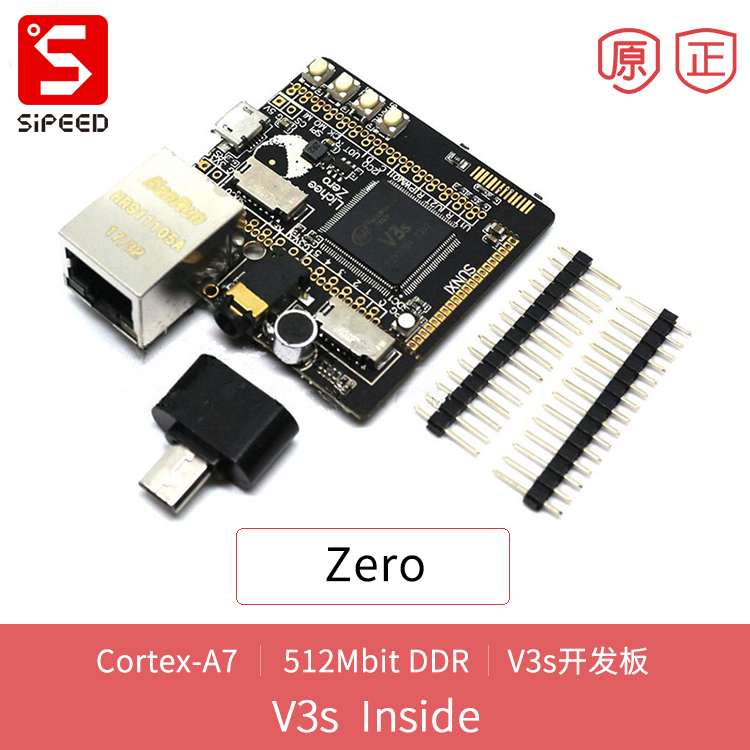
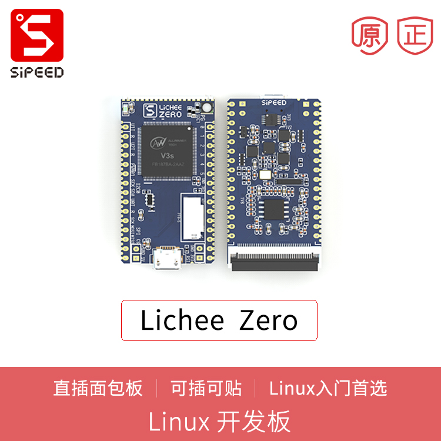

荔枝派 Zero
==============

荔枝派Zero是一款精致迷你的Cortex-A7核心板/开发板，适用于初学者学习linux或商用产品开发。

更多详细介绍请看 [文档](http://zero.lichee.pro)

可选搭配 [WiFi BT 模块](../modules/wifi.md)

## 资料

* [文档](http://zero.lichee.pro)
* [其它资料](http://dl.sipeed.com/LICHEE/Zero/)

