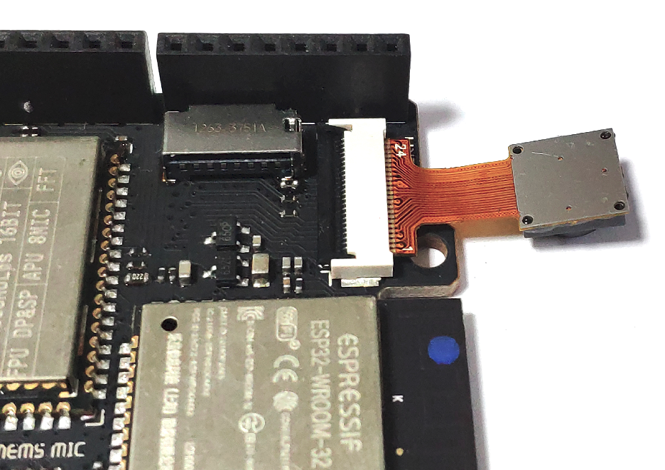
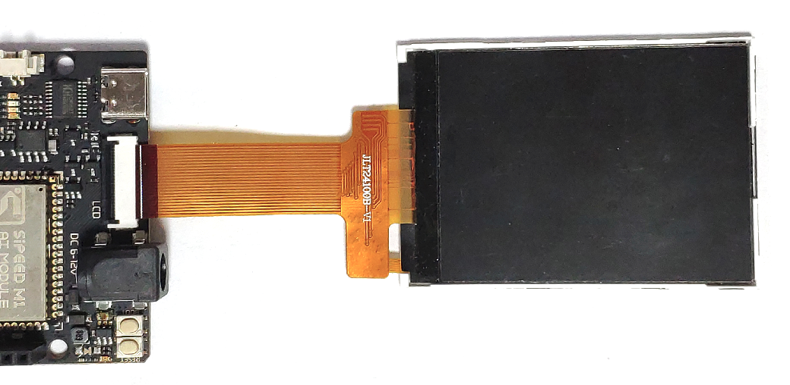

开发板 Maixduino
===========

* Arduino UNO R3 外形和引脚兼容
* Maix M1 模组
* ESP32-WROOM-32 WiFi 模组（2.4G WiFi+蓝牙）
* 4 个指示灯（esp32 和 k210 串口发送接收指示灯）
* 2 个按钮（复位和启动选择(开机后可自定义功能)按钮）
* Type-C 接口
* Micro SD 卡槽
* 1 个 CH552 USB 转 TTL 芯片
* 2 个 FPC 座子（摄像头和屏幕）
* 1 个 Mic
* 1 个单声道音频功放（NS4150）
* 1 个 LCD 触摸屏幕（可选）
* 1 个 1.25mm 音频输出母座

## 组装

注意摄像头和屏幕的安装方向，否则可能无法工作或损坏器件

摄像头朝背面：

屏幕朝正面

## 资料

* [引脚图 PNG 下载](https://cdn.sipeed.com/wiki/maix/maixduino/maixduino_pins.png)
* 规格书（包含引脚连接表格）：[Specifications](http://dl.sipeed.com/MAIX/HDK/Maixduino/Specifications/)
* 硬件资料： [dl.sipeed.com](http://dl.sipeed.com/MAIX/HDK/Maixduino/)
* [SDK](../sdk/README.md)： 适用于 k210 系列所有 SDK

