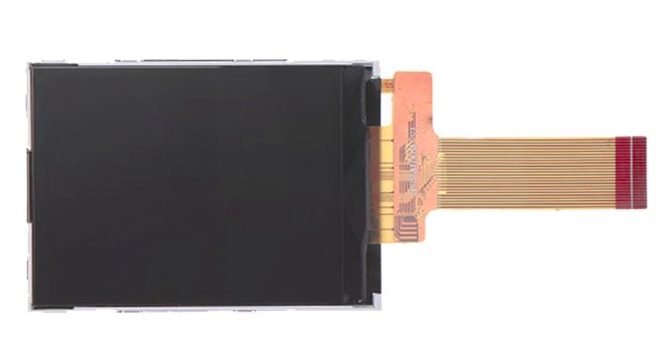

LCD 模块
========

## 320x240 LCD 模块

可与 Maix 系列 K210 开发板搭配使用

### 资料

* [Maix LCD 硬件资料](http://dl.sipeed.com/MAIX/HDK/Maix-LCD/)
* [LCD 硬件资料](http://dl.sipeed.com/Accessories/LCD/)

## 荔枝派显示模块

详情查看[淘宝](https://item.taobao.com/item.htm?id=585048350908#)

* [LCD 硬件资料](http://dl.sipeed.com/Accessories/LCD/)

